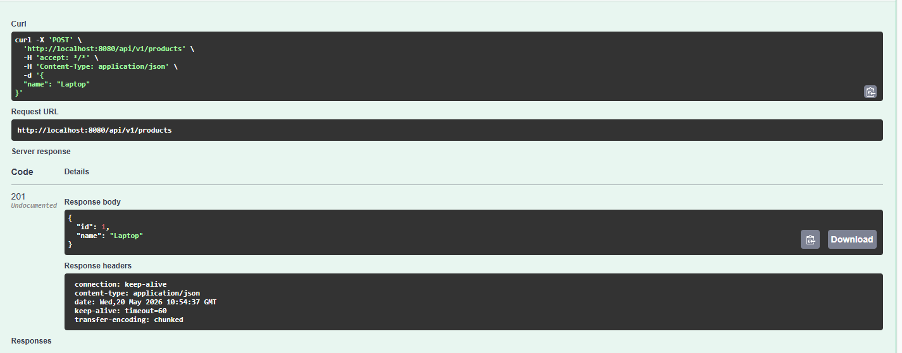
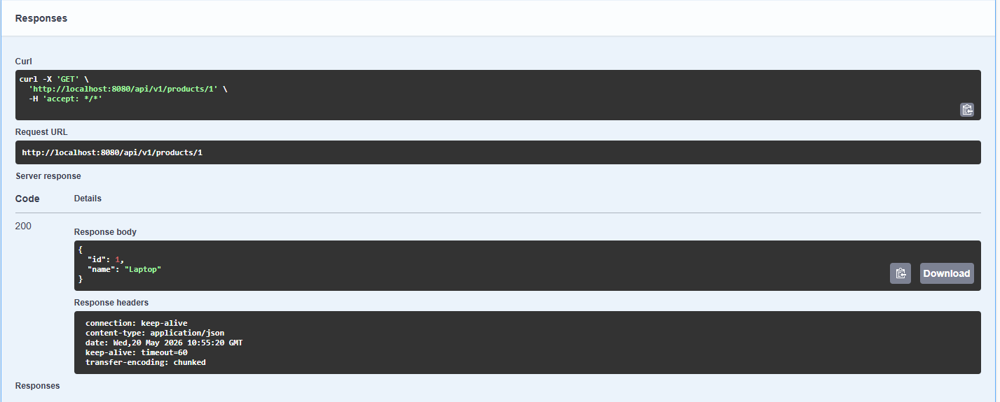
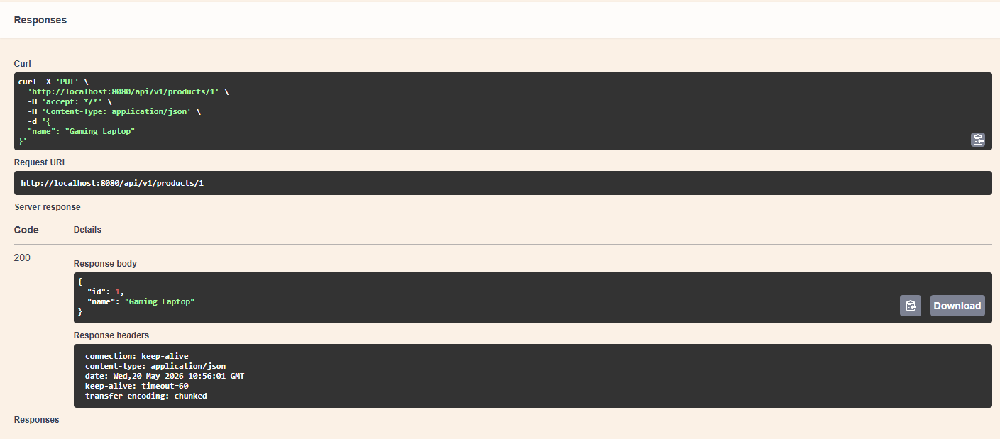
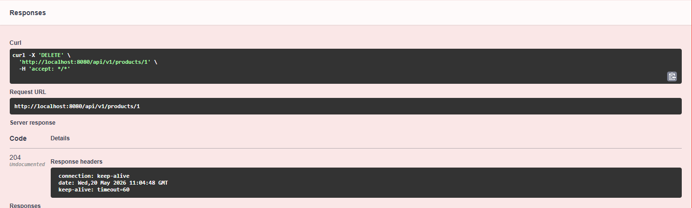
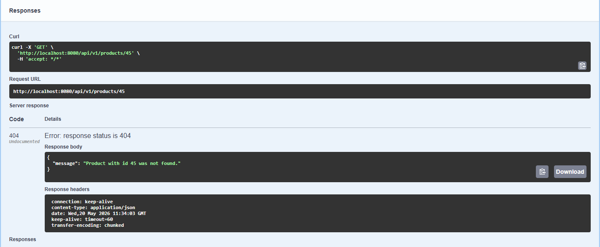

# Task 2 – Spring Boot REST API (Product Management)

## Description

This project is a fully functional **REST API** built with Spring Boot. It manages products and supports all CRUD operations:  
- **Create** a product  
- **Read** a product by ID or all products  
- **Update** a product  
- **Delete** a product  

Data is stored in an **in‑memory H2 database** and the API is documented with **Swagger UI**.

## Technologies Used

- Java 17
- Spring Boot (latest stable)
- Spring Web
- Spring Data JPA
- H2 Database
- Maven
- Swagger / OpenAPI (springdoc-openapi)
- Postman / Swagger UI for testing

## Prerequisites

- JDK 17 or higher
- IntelliJ IDEA (or any Java IDE)
- Maven (or use the Maven wrapper)

## How to Run the Project

1. **Clone the repository**  
   

2. **Open the project** in IntelliJ IDEA (or your preferred IDE).

3. **Build the project** – Maven will download all dependencies automatically.

4. **Run the main class**  
   `FirstRestApiApplication.java` (located in the base package).

5. The application starts on **port 8080**.  
   You will see Spring Boot startup logs in the console.

## Testing the API

You can test the endpoints using:

- **Swagger UI** (recommended) – [http://localhost:8080/swagger-ui/index.html](http://localhost:8080/swagger-ui/index.html)
- **Postman** – send HTTP requests manually
- **Your browser** – only for GET requests

## API Endpoints

All endpoints are prefixed with `/api/v1/products`.

| Method | Endpoint                | Description                 |
|--------|-------------------------|-----------------------------|
| POST   | `/api/v1/products`      | Create a new product        |
| GET    | `/api/v1/products/{id}` | Get a product by its ID     |
| GET    | `/api/v1/products`      | Get all products            |
| PUT    | `/api/v1/products/{id}` | Update an existing product  |
| DELETE | `/api/v1/products/{id}` | Delete a product by ID      |

## Screenshots

### 1. Create Product (POST)



### 2. Get Product by ID (GET)



### 3. Get All Products (GET)


### 4. Update Product (PUT)



### 5. Delete Product (DELETE)



### 6. Error Handling (404 Not Found)



## Request / Response Examples

#### 1. Create Product (POST)

**Request**  
`POST http://localhost:8080/api/v1/products`  
**Body** (JSON):
```json
{
  "name": "Laptop"
}
